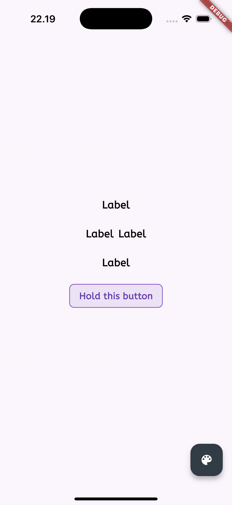

# RATooltip 🎯

A highly customizable and feature-rich tooltip widget for Flutter applications with smooth animations, smart positioning, and multiple trigger modes.

## Preview 📱



## Features ✨

- 🎯 **Multiple Trigger Modes**: `tap` and `hold` (500ms duration)
- 📍 **Smart Positioning**: Automatic edge detection with 4 positions (top, bottom, left, right)
- 🎨 **Highly Customizable**: Colors, messages, styling, padding, and box shadows
- ✨ **Smooth Animations**: 150ms duration with easeOutCubic curves
- 🔄 **Auto-Adjustment**: Automatically repositions when hitting screen edges
- 📱 **Cross-Platform**: Works on Android, iOS, macOS, Linux, Windows, and Web
- 🎭 **Custom Content**: Support for both text messages and custom widgets
- 🎪 **Arrow Indicators**: Animated arrows pointing to target widgets
- 🚀 **Performance Optimized**: Efficient rendering with minimal rebuilds

## Installation 📦

Add `ra_tooltip` to your `pubspec.yaml`:

```yaml
dependencies:
  ra_tooltip: ^1.0.0
```

Or install it from GitHub:

```yaml
dependencies:
  ra_tooltip:
    git:
      url: https://github.com/RamaMS06/ra_tooltip.git
      ref: main
```

Then run:

```bash
flutter pub get
```

## Quick Start 🚀

Import the package:

```dart
import 'package:ra_tooltip/ra_tooltip.dart';
```

### Basic Usage

```dart
RATooltip(
  message: 'This is a tooltip!',
  child: Text('Hover me'),
)
```

### With Custom Styling

```dart
RATooltip(
  message: 'Custom styled tooltip',
  color: Colors.deepPurple,
  position: RATooltipPosition.bottom,
  messageStyle: TextStyle(
    color: Colors.white,
    fontWeight: FontWeight.bold,
  ),
  child: Icon(Icons.info),
)
```

## Usage Examples 📋

### 1. Tap Trigger (Default)

```dart
RATooltip(
  trigger: RATooltipTrigger.tap,
  message: 'Tap to toggle tooltip',
  color: Colors.blue,
  child: ElevatedButton(
    onPressed: () {},
    child: Text('Tap Me'),
  ),
)
```

### 2. Hold Trigger

```dart
RATooltip(
  trigger: RATooltipTrigger.hold,
  message: 'Hold for 500ms to show',
  color: Colors.green,
  position: RATooltipPosition.top,
  child: Container(
    padding: EdgeInsets.all(16),
    decoration: BoxDecoration(
      color: Colors.green.withOpacity(0.1),
      borderRadius: BorderRadius.circular(8),
      border: Border.all(color: Colors.green),
    ),
    child: Text('Hold Me'),
  ),
)
```

### 3. Custom Widget Content

```dart
RATooltip(
  customMessage: Column(
    mainAxisSize: MainAxisSize.min,
    children: [
      Icon(Icons.star, color: Colors.yellow),
      SizedBox(height: 8),
      Text('Custom Content!'),
      Text('Multiple lines supported'),
    ],
  ),
  color: Colors.purple,
  padding: EdgeInsets.all(16),
  child: Text('Custom Content'),
)
```

### 4. Different Positions

```dart
// Top position
RATooltip(
  message: 'I appear on top',
  position: RATooltipPosition.top,
  child: Text('Top'),
)

// Bottom position
RATooltip(
  message: 'I appear below',
  position: RATooltipPosition.bottom,
  child: Text('Bottom'),
)

// Left position
RATooltip(
  message: 'I appear on the left',
  position: RATooltipPosition.left,
  child: Text('Left'),
)

// Right position
RATooltip(
  message: 'I appear on the right',
  position: RATooltipPosition.right,
  child: Text('Right'),
)
```

### 5. Advanced Customization

```dart
RATooltip(
  message: 'Advanced tooltip',
  color: Color(0xFF2D3748),
  messageStyle: TextStyle(
    color: Colors.white,
    fontSize: 14,
    fontWeight: FontWeight.w500,
  ),
  padding: EdgeInsets.symmetric(horizontal: 16, vertical: 12),
  boxShadow: [
    BoxShadow(
      color: Colors.black26,
      blurRadius: 10,
      offset: Offset(0, 4),
    ),
  ],
  onTapOutside: (event) {
    print('Tapped outside tooltip');
  },
  child: Container(
    padding: EdgeInsets.all(12),
    decoration: BoxDecoration(
      gradient: LinearGradient(
        colors: [Colors.blue, Colors.purple],
      ),
      borderRadius: BorderRadius.circular(8),
    ),
    child: Text(
      'Advanced',
      style: TextStyle(color: Colors.white),
    ),
  ),
)
```

## API Reference 📚

### RATooltip Properties

| Property | Type | Default | Description |
|----------|------|---------|-------------|
| `message` | `String?` | `null` | Text message to display in tooltip |
| `customMessage` | `Widget?` | `null` | Custom widget content for tooltip |
| `child` | `Widget` | **required** | Widget that triggers the tooltip |
| `trigger` | `RATooltipTrigger` | `tap` | How the tooltip is triggered |
| `position` | `RATooltipPosition` | `top` | Where the tooltip appears |
| `color` | `Color?` | `Color(0xFF333F47)` | Background color of tooltip |
| `messageStyle` | `TextStyle?` | `null` | Style for the message text |
| `messageAlign` | `TextAlign` | `center` | Text alignment for message |
| `padding` | `EdgeInsets?` | `EdgeInsets.all(8)` | Internal padding of tooltip |
| `boxShadow` | `List<BoxShadow>?` | Default shadow | Custom shadow effects |
| `enabled` | `bool` | `true` | Whether tooltip is enabled |
| `onTapOutside` | `Function(PointerDownEvent)?` | `null` | Callback when tapping outside |

### Enums

#### RATooltipTrigger
- `tap` - Show/hide on tap
- `hold` - Show after holding for 500ms

#### RATooltipPosition  
- `top` - Above the target widget
- `bottom` - Below the target widget
- `left` - To the left of target widget
- `right` - To the right of target widget

## Smart Positioning 🧠

RATooltip automatically detects screen edges and repositions itself to ensure it's always visible:

- If a tooltip would appear off-screen, it automatically chooses the best alternative position
- Maintains proper spacing from screen edges (16px minimum margin)
- Arrows automatically adjust to point to the correct target location
- Smooth transitions between position changes

## Animation Details 🎬

- **Duration**: 150ms for smooth, responsive feel
- **Curve**: `Curves.easeOutCubic` for natural motion
- **Scale Animation**: Tooltips scale in/out from the target widget
- **Position Transitions**: Smooth repositioning when screen edges are detected

## Platform Support 🌐

RATooltip works seamlessly across all Flutter-supported platforms:

- ✅ **Android** (API 16+)
- ✅ **iOS** (iOS 9.0+)  
- ✅ **macOS** (macOS 10.11+)
- ✅ **Linux**
- ✅ **Windows** (Windows 7+)
- ✅ **Web** (All modern browsers)

## Performance 🚀

- **Efficient Rendering**: Uses `RepaintBoundary` for optimal performance
- **Minimal Rebuilds**: Smart state management reduces unnecessary rebuilds  
- **Memory Optimized**: Proper disposal of timers and animation controllers
- **Gesture Optimization**: Efficient gesture detection with minimal overhead

## Testing 🧪

The package includes comprehensive tests:

```bash
# Run unit tests
flutter test

# Run integration tests
flutter test integration_test/
```

## Example App 📱

Check out the comprehensive example app in the `example/` directory:

```bash
cd example
flutter run
```

The example demonstrates:
- All trigger modes
- Different positions
- Custom styling
- Edge detection
- Performance optimization

## Contributing 🤝

Contributions are welcome! Please feel free to submit a Pull Request. For major changes, please open an issue first to discuss what you would like to change.

### Development Setup

1. Fork the repository
2. Clone your fork: `git clone https://github.com/YourUsername/ra_tooltip.git`
3. Create a feature branch: `git checkout -b feature/amazing-feature`
4. Make your changes
5. Add tests for your changes
6. Ensure tests pass: `flutter test`
7. Commit your changes: `git commit -m 'Add amazing feature'`
8. Push to the branch: `git push origin feature/amazing-feature`
9. Open a Pull Request

## License 📄

This project is licensed under the MIT License - see the [LICENSE](LICENSE) file for details.

## Changelog 📝

See [CHANGELOG.md](CHANGELOG.md) for a detailed list of changes and versions.

## Support 💬

If you like this package, please give it a ⭐ on [GitHub](https://github.com/RamaMS06/ra_tooltip)!

For issues, feature requests, or questions:
- 🐛 [Report bugs](https://github.com/RamaMS06/ra_tooltip/issues)
- 💡 [Request features](https://github.com/RamaMS06/ra_tooltip/issues)
- 📧 Contact: [Your Email]

---

Made with ❤️ by [Rama Muhammad S](https://github.com/RamaMS06)